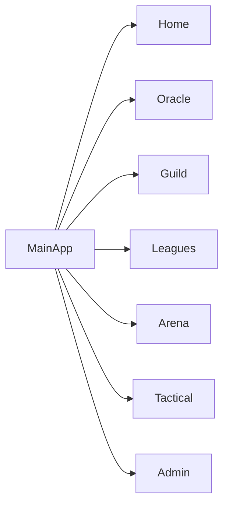
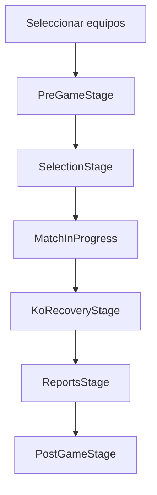

# Cerebro de Blood Bowl Manager

Este documento sirve como mapa vivo de la aplicación: cómo está construida, qué enlaza con qué, qué estilo visual usa y qué hay que tocar si queremos cambiar algo sin romper el resto.

La idea no es repetir la documentación de producto, sino dejar una guía técnica de trabajo para debatir cambios futuros con contexto completo.

## 1. Resumen ejecutivo

Blood Bowl Manager es una SPA en React que combina:

- datos maestros de Blood Bowl
- gestión de franquicias del usuario
- competiciones y ligas
- motor de partido
- panel de administración
- capas de estilo y navegación comunes

La aplicación está pensada como un sistema modular:

- `App.tsx` resuelve login, idioma y entrada principal.
- `MainApp.tsx` orquesta la navegación de alto nivel.
- cada página importante vive en `pages/`.
- la edición y persistencia de dominio vive en `components/shared/`, `components/guild/` y `hooks/`.

## 2. Stack técnico

### Tecnologías base

- React 19
- Vite
- TypeScript
- Firestore
- Tailwind CSS
- Framer Motion

### Entradas principales

- `index.tsx`: arranque de React.
- `App.tsx`: decide entre login y aplicación.
- `components/shared/MainApp.tsx`: shell principal después del login.

### Librerías de apoyo

- Firebase Auth / Firestore
- `react-router` no parece ser el eje principal; la navegación se controla internamente por vistas
- Framer Motion para transiciones y paneles
- `localStorage` para estado auxiliar y compatibilidad con datos locales

## 3. Arranque de la aplicación

```mermaid
flowchart TD
    A[index.tsx] --> B[App.tsx]
    B --> C{firebaseError?}
    C -->|sí| D[Pantalla de error]
    C -->|no| E[useAuth()]
    E --> F{usuario logueado?}
    F -->|no| G[Login]
    F -->|sí| H[LanguageProvider]
    H --> I[ErrorBoundary]
    I --> J[MainApp]
```

### Qué hace cada parte

- `App.tsx`
  - comprueba configuración de Firebase
  - espera autenticación
  - aplica `LanguageProvider`
  - monta `MainApp`

- `MainApp.tsx`
  - controla la vista activa
  - carga datos compartidos
  - conecta el menú superior con cada sección
  - mantiene notificaciones, sincronización, ligas locales y estado auxiliar

## 4. Mapa de secciones



### Vistas de `MainApp`

El tipo de vista principal es:

- `home`
- `oracle`
- `starplayers`
- `guild`
- `tactical`
- `arena`
- `leagues`
- `guide`
- `admin`

Cada vista se puede resetear al volver a pulsar la misma pestaña del top nav.

## 5. Qué enlaza con qué

### `App.tsx`

Enlaza:

- `useAuth()` -> login/logout
- `LanguageProvider` -> idioma de toda la app
- `Login` -> pantalla de acceso
- `MainApp` -> aplicación real
- `ErrorBoundary` -> protección general

### `components/shared/MainApp.tsx`

Enlaza:

- `pages/Home/index.tsx`
- `pages/Oracle/index.tsx`
- `pages/Guild/index.tsx`
- `pages/Guild/TacticalBoardPage.tsx`
- `pages/Arena/MatchPage.tsx`
- `pages/Arena/LeaguesPage.tsx`
- `components/shared/AdminPanel.tsx`
- `components/common/UserProfile.tsx`
- `components/common/SyncStatusIndicator.tsx`

Además:

- conecta Firestore con los estados compartidos
- mantiene `managedTeams`, `leagues`, `plays`, `matchReports`, `recentEvents`
- sincroniza notificaciones
- gestiona la navegación a partidos concretos

### `pages/Guild/index.tsx`

Enlaza:

- `TeamCreator`
- `TeamDashboard`
- `ManagedTeam`
- `matchReports`
- `competitions`
- `onTeamCreate`, `onTeamUpdate`, `onTeamDelete`

Funciona como:

- lista de franquicias
- resumen del gremio
- entrada al dossier de cada equipo
- flujo de fundación

### `components/guild/TeamDashboard.tsx`

Enlaza:

- plantilla activa
- resumen de staff
- historial
- reclutamiento
- imágenes del escudo
- modal de jugador

Es la pieza más grande del flujo de gremio y la que concentra:

- edición rápida de dorsal
- cambio reserva/titular
- cambio de nombre
- habilidades extra
- visualización de la plantilla

### `components/guild/PlayerModal.tsx`

Enlaza:

- edición individual de jugador
- dorsal
- puntos de estrella
- partidos de sanción
- habilidades extra
- lesiones permanentes
- rol titular/reserva

### `pages/Oracle/index.tsx`

Enlaza:

- `TeamsPage`
- `SkillsPage`
- `StarPlayersPage`
- `ProbabilitiesPage`
- `InducementsPage`
- `RulesPage`

Es el hub del conocimiento del juego.

### `pages/Arena/LeaguesPage.tsx`

Enlaza:

- `CompetitionCard`
- `LeaguesTabbedList`
- `competitionUtils`
- navegación a partidos

### `pages/Arena/MatchPage.tsx`

Enlaza:

- `MatchProvider`
- `MatchOrchestrator`
- flujo de partido por fases

### `components/shared/AdminPanel.tsx`

Enlaza:

- formularios especializados
- catálogo maestro
- import/export
- sincronización inteligente
- laboratorio de competiciones
- notificaciones

## 6. Capa de datos

### Firestore

Colecciones más relevantes:

- `master_data`
- `settings_master`
- `users/{uid}`
- `managedTeams`
- `competitions`
- `leagues`
- `live_matches`
- `tactical_plays`

### Qué vive en cada una

- `master_data`
  - equipos base
  - habilidades
  - jugadores estrella
  - incentivos
  - heraldo

- `settings_master`
  - imagen hero
  - configuración general
  - configuración de arena

- `managedTeams`
  - franquicias creadas por usuarios
  - jugadores, staff, escudo, historial

- `competitions` / `leagues`
  - ligas y torneos
  - participantes
  - emparejamientos

- `live_matches`
  - partidos en curso

- `tactical_plays`
  - jugadas guardadas

### Normalización de datos

Hay varias capas de saneado:

- `hooks/useMasterData.ts`
  - lee catálogos maestros
  - normaliza texto
  - elimina `undefined`
  - compatibilidad con datos viejos

- `utils/teamData.ts`
  - normaliza `ManagedTeam`
  - normaliza `ManagedPlayer`
  - corrige legacy data
  - evita arrays rotos

- `utils/imageUtils.ts`
  - resuelve nombres de escudos y fotos
  - soporta alias en español e inglés

### Importante

La app no da por bueno lo que venga tal cual desde Firestore. Primero normaliza y luego pinta.

## 7. Sistema de imágenes

### Repositorio externo

La app usa `jaz206/Bloodbowl-image` como fuente de assets.

Carpetas principales:

- `Escudos`
- `Star Players`
- `Foto plantilla`

### Uso

- el admin busca imágenes directamente en GitHub
- las URLs se guardan como enlaces `raw.githubusercontent.com`
- el frontend resuelve escudos por nombre canónico

### Regla de oro

La imagen que se ve en la UI no siempre es la que está escrita literalmente en el documento. Puede pasar por:

1. `team.crestImage`
2. nombre canónico de escudo
3. fallback de raza
4. URL de soporte

## 8. Estilo CSS y UX

La app no usa un look genérico. Tiene un sistema visual propio basado en `index.css` y clases semánticas.

### Fuentes

- `Public Sans` para texto general
- `Epilogue` para titulares, números, nav y CTAs

### Variables de color base

Definidas en `index.css`:

- `--blood-red`
- `--premium-gold`
- `--pitch-green`
- `--background-dark`
- superficies `--surface-0` a `--surface-3`
- bordes suaves y sombras de superficie

### Lenguaje visual

La UI mezcla:

- fantasía oscura
- premium editorial
- bento cards
- glassmorphism controlado
- navegación tipo cápsula
- métricas grandes y legibles

### Clases de estilo principales

- `.blood-ui-shell`
  - fondo general de la app
  - degradados radiales + base cálida

- `.blood-ui-header`
  - barra superior oscura
  - border y sombra de panel

- `.blood-ui-card`
  - card oscura glass

- `.blood-ui-card-strong`
  - card más robusta
  - más contraste para paneles críticos

- `.blood-ui-input`
  - input oscuro
  - focus dorado

- `.blood-ui-light-card`
  - tarjeta clara para gremio, oráculo y algunos hubs

- `.blood-ui-light-input`
  - input claro usado en pantallas beige

- `.blood-ui-button-primary`
  - botón oro

- `.blood-ui-button-secondary`
  - botón secundario oscuro o claro según contexto

- `.blood-ui-chip`
  - chip de estado / etiqueta

- `.blood-ui-topnav`
  - navegación superior

- `.guild-summary-card`
  - tarjeta de resumen con brillo sutil

- `.arena-light`, `.admin-light`, `.guild-dossier-light`, `.guild-creation-light`
  - wrappers temáticos por sección

### UIX / experiencia de usuario

Patrones recurrentes:

- títulos en mayúsculas e itálica
- tracking amplio
- botones redondeados
- sombras suaves con glow dorado
- paneles con capas y profundidad
- cards grandes, aireadas y legibles
- foco visual muy marcado en el dato importante

### Responsive

La app cambia de composición por breakpoint:

- móvil: una sola columna y navegación simplificada
- tablet: mezcla de columnas con bloques flexibles
- desktop: grids más complejos, lateral fijo y resúmenes visibles

## 9. Qué página usa qué estilo

### `Home`

- mezcla `home-panel-light` con cards de resumen
- hero principal grande
- accesos rápidos

### `Oráculo`

- usa estilo claro editorial
- cards limpias
- búsquedas y fichas con más densidad informativa

### `Gremio`

- usa `guild-dossier-light`
- es la vista más “gestión premium”
- prioriza la ficha del equipo, la plantilla y el escudo

### `Arena`

- usa `arena-light` y `arena-match-light`
- más contraste y más sensación de mesa de juego

### `Admin`

- usa `admin-light`
- pensado para edición masiva
- debe ser rápido, claro y estable

## 10. Flujo de partidas



### Capas implicadas

- `MatchOrchestrator`
  - orquesta la secuencia

- `MatchContext`
  - guarda estado del partido

- `useMatchState`
  - estado principal

- `useMatchActions`
  - acciones permitidas

- `matchEngine`, `injuryEngine`, `foulEngine`, `sppEngine`
  - reglas de resolución

### Idea central

Arena debe ser una simulación guiada por UI, no una pantalla fija. Cada etapa tiene su propio peso.

## 11. Oráculo como hub de conocimiento

El hub del Oráculo está pensado para consultar y saltar de una pieza a otra:

- equipos
- habilidades
- jugadores estrella
- reglas
- incentivos
- calculadora

Conexiones importantes:

- `OraclePage` usa `useMasterData`
- `TeamsPage` usa `teamsData` + datos maestros
- `SkillsPage` usa `skills`
- `StarPlayersPage` usa `starPlayers`
- `RulesPage` y `InducementsPage` son referencia directa

## 12. Admin como consola de mantenimiento

El admin ya no es un bloque único. Está dividido por dominio:

- general
- equipos
- estrellas
- habilidades
- incentivos
- heraldo
- competiciones

### Lo importante del admin

- el guardado termina en Firestore
- el editor usa validaciones y saneado
- el usuario ve dónde guarda cada pestaña
- las imágenes se seleccionan desde GitHub
- hay recomendaciones de encuadre para escudos

### Qué enlaza con qué

- `AdminPanel` decide qué dominio se está editando
- `AdminEditorModal` abre el formulario concreto
- cada formulario actualiza solo su parte del objeto
- `adminSanitizers.ts` limpia antes de persistir

## 13. Reglas de negocio que conviene no romper

- `managedTeams` no debe aceptar basura en `players`
- `participantIds` debe seguir coherente con dueño y creador
- `team.crestImage` prevalece sobre el fallback
- la app debe seguir funcionando si Firestore tiene datos viejos
- los cambios del usuario deben reflejarse sin recargar toda la página

## 14. Cómo debatir futuros cambios

Antes de tocar una pieza, hay que preguntarse:

1. ¿Qué sección afecta?
2. ¿Qué datos lee?
3. ¿Qué datos escribe?
4. ¿Qué componentes comparte con otras secciones?
5. ¿Qué clases de estilo reutiliza?
6. ¿Rompe compatibilidad con datos viejos?
7. ¿Necesita actualizar Firestore, el catálogo local o ambos?

## 15. Dónde mirar primero si algo falla

- problema de login -> `App.tsx`, `useAuth`
- problema de navegación -> `MainApp.tsx`
- problema de franq. -> `pages/Guild/index.tsx`, `TeamDashboard.tsx`
- problema de edición jugador -> `PlayerModal.tsx`
- problema de datos maestros -> `useMasterData.ts`, `AdminPanel.tsx`
- problema de imágenes -> `imageUtils.ts`
- problema visual -> `index.css`
- problema de partido -> `pages/Arena/Match/*`

## 16. Documento vivo

Este archivo está pensado como notebook de la app.

Cuando añadamos:

- manuales de Blood Bowl
- equipos
- reglas nuevas
- cambios de interfaz
- nuevos modos de juego

debería actualizarse este mapa para que siga representando la app real y no una foto antigua del proyecto.

